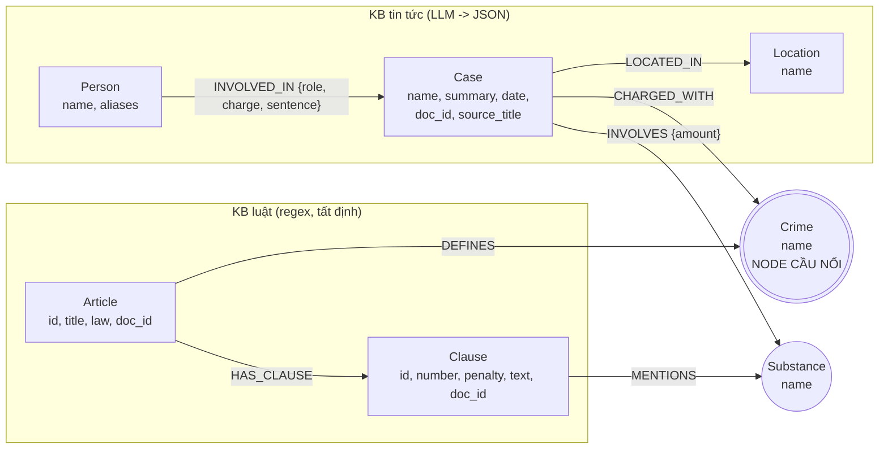

# Thiết kế Ontology — Day 19

**Họ tên:** Võ Doanh Nhân  **MSSV:** 2A202602770

**Lựa chọn** (đánh dấu một):
- [x] Dùng ontology gợi ý (có thể chỉnh nhỏ)
- [ ] Tự thiết kế (xét bonus +15, xem `SUBMISSION.md`)

> Tôi dùng đúng ontology gợi ý trong `src/graph.py` (các hàm `parse_law_article`, `extract_news_cases`, `add_law_article`, `add_news_case`, `suggested_constraints`), không đổi label hay quan hệ. Phần tôi tự viết là KG-1 (`link_entity`), KG-2 (`build_graph` gọi lại các hàm HINT), KG-3 (`Neo4jGraph.context`, các truy vấn Cypher đi qua cầu nối) và KG-4 (`GraphRAGAgent.answer`). Mọi nhãn/quan hệ dưới đây đã đối chiếu với graph thật bằng `MATCH (n) RETURN DISTINCT labels(n)` và `MATCH ()-[r]->() RETURN DISTINCT type(r)` (graph 203 node / 379 cạnh, lần chạy tạo ra `ket_qua_benchmark_kg.txt`).

## 1. Sơ đồ

Node cầu nối là **Crime** (tô đậm).

## 2. Entity types (node labels)

| Label | Ý nghĩa | Khóa định danh (`MERGE` theo) | Properties | Lấy từ KB nào | Trích bằng (regex / LLM / khác) |
| --- | --- | --- | --- | --- | --- |
| `Article` | Một Điều luật | `id` (vd. "Điều 251 BLHS") | `title`, `law`, `doc_id` | Luật | regex |
| `Clause` | Một khoản của Điều | `id` (vd. "Điều 251 BLHS khoản 4") | `number`, `penalty`, `text`, `doc_id` | Luật | regex |
| `Crime` | Tội danh chuẩn, **node cầu nối** | `name` (viết thường, bỏ "Tội ") | `name` | Luật (tên Điều); Tin (`link_entity` đưa tên báo về tên chuẩn) | regex + `link_entity` |
| `Case` | Một vụ việc trong bài báo | `name` (do LLM đặt) | `summary`, `date`, `doc_id`, `source_title` | Tin tức | LLM (JSON) |
| `Person` | Bị cáo / bị can / người liên quan | `name` | `aliases` | Tin tức | LLM |
| `Substance` | Chất ma túy | `name` | `name` | Luật (regex trên text khoản) và Tin (LLM) | regex + LLM |
| `Location` | Tỉnh/thành | `name` | `name` | Tin tức | LLM |

`Case`, `Clause`, `Article` mang `doc_id = Document.id`. `Crime`, `Substance`, `Location`, `Person` là node dùng chung giữa nhiều tài liệu nên không có `doc_id` (đúng như `--build` báo).

## 3. Relationships

| Type | Từ → Đến | Properties trên cạnh | Ý nghĩa |
| --- | --- | --- | --- |
| `DEFINES` | Article → Crime | — | Điều luật quy định tội danh nào |
| `HAS_CLAUSE` | Article → Clause | — | Điều gồm các khoản |
| `MENTIONS` | Clause → Substance | — | Khoản nhắc tới chất nào |
| `CHARGED_WITH` | Case → Crime | — | Vụ việc bị truy tố về tội nào (**cầu nối**) |
| `INVOLVES` | Case → Substance | `amount` (nguyên văn, vd. "9.6kg") | Vụ việc liên quan chất nào, bao nhiêu |
| `LOCATED_IN` | Case → Location | — | Địa điểm vụ việc |
| `INVOLVED_IN` | Person → Case | `role`, `charge`, `sentence` | Người tham gia vụ việc, tội danh và mức án của người đó |

## 4. Node cầu nối giữa 2 KB

- **Node nào:** `Crime`.
- **Vì sao chọn node này:** tội danh là thực thể duy nhất mà **cả hai KB cùng gọi tên**: luật đặt tên Điều ("Tội mua bán trái phép chất ma túy"), bài báo nêu tội danh của bị cáo. Số hiệu Điều thì báo chí hầu như không nêu, nên không thể nối qua `Article.id`.
- **Cách đảm bảo hai phía khớp tên:** (1) tên chuẩn lấy từ chính tên Điều luật bằng regex (`normalize_crime`); (2) prompt trích xuất đưa **danh sách tên chuẩn** vào và yêu cầu chọn nguyên văn; (3) vì LLM không luôn tuân thủ, mọi tội danh vẫn qua `link_entity` (KG-1: chuẩn hóa cả hai phía, khớp chính xác trước, sau đó `difflib` ngưỡng 0,8, trả đúng cách viết trong danh sách chuẩn).
- **Khi nào cầu gãy, và xử lý thế nào:** gãy khi tội danh trong bài **không thuộc KB luật ma túy**. Trong graph hiện có đúng 1 vụ như vậy: "Vụ tông cảnh sát giao thông ở An Giang", tội danh trong bài là "chống người thi hành công vụ", nên `link_entity` trả `None` và `Case` không có `CHARGED_WITH`. Trường hợp này **hợp lý** (bài nằm ngoài phạm vi luật ma túy) nên không ép nối; hệ quả là thông tin tội danh đó không còn trong graph (xem E1/E6 ở `REPORT_KG.md`).

## 5. Competency questions

Với mỗi câu trong `data/benchmark_kg.json`, đường đi trên graph dùng để trả lời:

| Câu | Đường đi (Cypher pattern) | Trả lời được? |
| --- | --- | --- |
| Q1 | `(Article)-[:HAS_CLAUSE]->(Clause)`: định nghĩa "tiền chất" nằm trong `Clause.text` của Luật PCMT Điều 1 | Có, nhưng graph không cần thiết: vector search đã đủ (cả hai pipeline đều đúng) |
| Q2 | `(Person)-[:INVOLVED_IN {sentence}]->(Case {doc_id})` | Có (cả hai pipeline đều đúng, đây là câu một nguồn) |
| Q3 | `(Person {name})-[:INVOLVED_IN {sentence}]->(Case)-[:CHARGED_WITH]->(Crime)<-[:DEFINES]-(Article)-[:HAS_CLAUSE]->(Clause {number:1})` | Có |
| Q4 | `(Person {aliases∋'Hoàng Nato'})-[:INVOLVED_IN]->(Case)-[:CHARGED_WITH]->(Crime)<-[:DEFINES]-(Article)-[:HAS_CLAUSE]->(Clause)`, rồi cần khoản có khung phạt cao nhất | **Chưa:** graph có khoản chung thân nhưng `context()` của tôi chỉ lấy khoản 1 khi câu hỏi không nhắc chất, nên câu trả lời sai (lỗi E2) |
| Q5 | `(Case)-[:INVOLVES {amount}]->(s:Substance)<-[:MENTIONS]-(Clause)<-[:HAS_CLAUSE]-(Article)`; LLM chọn khoản theo khối lượng | Có: trả lời đúng "Điều 250 khoản 4" (Flat gọi nhầm "khoản b)") |
| Q6 | `(Case)-[:INVOLVES]->(:Substance {name:'MDMA'})` (gom nhóm) | Có (graph liệt kê 4 vụ MDMA), nhưng độ đầy đủ phụ thuộc cách LLM tách `Case` khi trích xuất |

## 6. Quyết định thiết kế và đánh đổi

1. **Cầu nối = `Crime`** (theo gợi ý). Phương án khác: nối qua `Article.id` hoặc qua `Substance`/`Location`. Giữ `Crime` vì cả hai KB đều nêu tên tội danh còn `Article.id` hiếm khi có trong báo, còn `Substance` không xác định được Điều luật. Đánh đổi: phụ thuộc chất lượng `link_entity`, tội danh ngoài luật ma túy không nối được.
2. **KG-3 lấy "khoản 1 + các khoản `MENTIONS` chất mà vụ đó `INVOLVES`"** thay vì lấy toàn bộ khoản của Điều hoặc chỉ khoản 1. Lấy toàn bộ thì đủ thông tin nhưng prompt rất dài và đắt; chỉ khoản 1 thì rẻ nhưng bỏ mất khoản quyết định theo khối lượng (Q5). Đánh đổi quan sát được: token mỗi câu gấp 5,38 lần Flat RAG, và vẫn thiếu khoản nặng nhất khi câu hỏi hỏi "tối đa" mà vụ không có chất cụ thể (Q4).
3. **KG-1 dùng `difflib` ngưỡng 0,8 sau khi chuẩn hóa** (thay vì khớp chính xác hoặc embedding). Chính xác thì bỏ lỡ biến thể "ma tuý"/"ma túy"; embedding tốn lời gọi và khó kiểm chứng; `difflib` tất định và đủ cho biến thể chính tả. Đánh đổi: ngưỡng 0,8 có thể nối nhầm hai tội danh có tên gần giống nhau khi tên của báo không khớp chính xác.
4. **`seed_facts` bỏ qua node `Clause`** (`skip_labels=("Clause",)`): bước 3 đã đưa nguyên văn khoản, nên lặp lại cạnh "Điều X → khoản N" chỉ tốn token.

## 7. So với ontology gợi ý (bắt buộc nếu xét bonus)

Không áp dụng: tôi dùng nguyên ontology gợi ý, không xét bonus.

## 8. Hạn chế còn lại

Các hạn chế đã đo được trên graph này (truy vấn nguyên văn ở `report/evidence/` và `REPORT_KG.md`):

- `Substance` khóa theo tên do LLM viết nên cùng một chất thành nhiều node: 18 node `Substance`, trong đó 3 cặp trùng hoa/thường (`Ketamine`/`ketamine`, `Cần sa`/`cần sa`, `Methamphetamine`/`methamphetamine`).
- `Case` khóa theo tên do LLM đặt: các bài về 'Hoàng Nato' tạo 4 `Case` riêng.
- Không có thuộc tính lưu tội danh gốc khi không nối được luật: `INVOLVED_IN` chỉ có `role`, `charge`, `sentence`; 9 trong 42 quan hệ có `charge` rỗng.
- Không mô hình hóa ngưỡng khối lượng trong khoản luật (LLM phải tự đọc văn bản các khoản để chọn khoản), và không phân biệt giai đoạn tố tụng.
- `context()` chưa có quy tắc cho câu hỏi "tối đa/cao nhất" nên bỏ sót khoản nặng nhất (lỗi E2).
