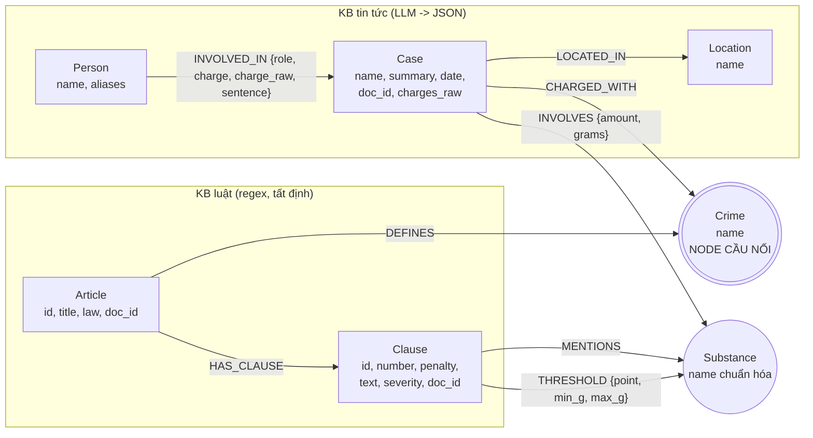

# Thiết kế Ontology — Day 19

**Họ tên:** Võ Doanh Nhân  **MSSV:** 2A202602770

**Lựa chọn** (đánh dấu một):
- [ ] Dùng ontology gợi ý (có thể chỉnh nhỏ)
- [x] Tự thiết kế (xét bonus +15, xem `SUBMISSION.md`)

> Ontology của tôi (gọi là **v2**) giữ bộ khung gợi ý (Crime là cầu nối) nhưng đổi 4 chỗ có chủ đích, mỗi chỗ xuất phát từ một lỗi **đo được** trên graph của ontology gợi ý (mục 7). Code dựng ontology này là mặc định trong `src/graph.py`; đặt `KG_ONTOLOGY=hint` để dựng lại ontology gợi ý (dùng cho `ket_qua_benchmark_kg.hint.txt`).

## 1. Sơ đồ

Node cầu nối là **Crime** (tô đậm). Thêm một cầu nối thứ hai **Substance**, vì cả `Clause` (luật) và `Case` (tin tức) đều trỏ tới nó; nhờ vậy chọn được khoản luật theo khối lượng.

## 2. Entity types (node labels)

| Label | Ý nghĩa | Khóa định danh (`MERGE` theo) | Properties | Lấy từ KB nào | Trích bằng (regex / LLM / khác) |
| --- | --- | --- | --- | --- | --- |
| `Article` | Một Điều luật | `id` (vd. "Điều 251 BLHS") | `title`, `law`, `doc_id` | Luật | regex (`parse_law_article_v2`) |
| `Clause` | Một khoản của Điều | `id` (vd. "Điều 251 BLHS khoản 4") | `number`, `penalty`, `text`, **`severity`**, `doc_id` | Luật | regex |
| `Crime` | Tội danh chuẩn, **node cầu nối** | `name` (viết thường, bỏ "Tội ") | `name` | Luật (tên Điều); Tin (`link_entity` đưa tên báo về tên chuẩn) | regex + `link_entity` |
| `Case` | Một vụ việc trong bài báo | `name` (LLM đặt) | `summary`, `date`, `doc_id`, `source_title`, **`charges_raw`** | Tin tức | LLM (JSON) |
| `Person` | Bị cáo/bị can/người liên quan | `name` | `aliases` | Tin tức | LLM |
| `Substance` | Chất ma túy, **chuẩn hóa** | `name` chuẩn (`canonical_substance`) | `name` | Luật (regex trên text khoản) và Tin (LLM) | regex + bảng chuẩn/alias |
| `Location` | Tỉnh/thành | `name` | `name` | Tin tức | LLM |

`Case`, `Clause` mang `doc_id = Document.id`; `Article` cũng có `doc_id`. `Crime`, `Substance`, `Location`, `Person` là node dùng chung giữa nhiều tài liệu nên không có `doc_id`.

## 3. Relationships

| Type | Từ → Đến | Properties trên cạnh | Ý nghĩa |
| --- | --- | --- | --- |
| `DEFINES` | Article → Crime | — | Điều luật quy định tội danh nào |
| `HAS_CLAUSE` | Article → Clause | — | Điều gồm các khoản |
| `MENTIONS` | Clause → Substance | — | Khoản nhắc tới chất nào (dùng khi không có khối lượng) |
| **`THRESHOLD`** | Clause → Substance | `point` (điểm a, b…), `min_g`, `max_g` (gam; `max_g` rỗng = "trở lên") | Khoản áp dụng cho chất đó ở khoảng khối lượng nào |
| `CHARGED_WITH` | Case → Crime | — | Vụ việc bị truy tố về tội nào (**cầu nối**) |
| `INVOLVES` | Case → Substance | `amount` (nguyên văn), **`grams`** (đã đổi ra gam) | Vụ việc liên quan chất nào, bao nhiêu |
| `LOCATED_IN` | Case → Location | — | Địa điểm vụ việc |
| `INVOLVED_IN` | Person → Case | `role`, `charge` (đã nối luật hoặc rỗng), **`charge_raw`** (nguyên văn), `sentence` | Người tham gia vụ việc |

## 4. Node cầu nối giữa 2 KB

- **Node nào:** `Crime`. Phụ trợ: `Substance` (cả khoản luật và vụ việc đều trỏ tới).
- **Vì sao chọn node này:** tội danh là thực thể duy nhất mà **cả hai KB cùng gọi tên**: luật đặt tên Điều ("Tội mua bán trái phép chất ma túy"), tin tức viết tội danh của bị cáo. Số hiệu Điều thì báo chí hầu như không nêu, nên không dùng `Article.id` làm cầu nối.
- **Cách đảm bảo hai phía khớp tên:** (1) tên chuẩn lấy từ chính tên Điều luật bằng regex (`normalize_crime`); (2) prompt trích xuất đưa **danh sách tên chuẩn** vào và yêu cầu chọn nguyên văn; (3) vì LLM không luôn tuân thủ, mọi tội danh vẫn qua `link_entity` (chuẩn hóa hai phía, khớp chính xác trước, sau đó `difflib` ngưỡng 0,8).
- **Khi nào cầu gãy, và xử lý thế nào:** gãy khi tội danh trong bài **không thuộc KB luật** (vd. "chống người thi hành công vụ", "nhận hối lộ", "lừa đảo"): `link_entity` trả `None` nên `Case` không có `CHARGED_WITH`. Đây là trường hợp **hợp lý** (bài viết ngoài phạm vi luật ma túy), nên không ép nối; thay vào đó tội danh gốc được **giữ lại** trong `Case.charges_raw` và `INVOLVED_IN.charge_raw` để không mất thông tin (ontology gợi ý bỏ mất).

## 5. Competency questions

Với mỗi câu trong `data/benchmark_kg.json`, đường đi trên graph dùng để trả lời:

| Câu | Đường đi (Cypher pattern) | Trả lời được? |
| --- | --- | --- |
| Q1 | `(Article {id:'…'})-[:HAS_CLAUSE]->(Clause)` (định nghĩa "tiền chất" nằm trong `Clause.text` của Luật PCMT Điều 1) | Có, nhưng graph không cần: vector search đủ (cả hai pipeline đúng) |
| Q2 | `(Person)-[:INVOLVED_IN {sentence:'tử hình'}]->(Case {doc_id: …})` | Có |
| Q3 | `(Person {name})-[:INVOLVED_IN {sentence}]->(Case)-[:CHARGED_WITH]->(Crime)<-[:DEFINES]-(Article)-[:HAS_CLAUSE]->(Clause {number:1})` | Có |
| Q4 | `(Person {aliases∋'Hoàng Nato'})-[:INVOLVED_IN]->(Case)-[:CHARGED_WITH]->(Crime)<-[:DEFINES]-(Article)-[:HAS_CLAUSE]->(Clause)` rồi lấy khoản có `severity` lớn nhất (v2) | Graph có đủ dữ kiện và `context()` trả được khoản 4 (chung thân), **nhưng** câu trả lời của LLM trong benchmark vẫn sai (xem báo cáo, lỗi E2/E5). Ngoài ra Hoàng Nato bị 3 tội khác nhau nên "tối đa" không đơn nghĩa |
| Q5 | `(Case)-[i:INVOLVES]->(s:Substance {name:'MDMA'})<-[t:THRESHOLD]-(Clause)<-[:HAS_CLAUSE]-(Article)` với `t.min_g <= i.grams < t.max_g` | Có: 9 600 g MDMA rơi vào Điều 250 khoản 4 (điểm b) bằng truy vấn cấu trúc |
| Q6 | `(Case)-[:INVOLVES]->(:Substance {name:'MDMA'})` (gom nhóm) | Một phần: graph liệt kê được các vụ liên quan MDMA nhưng đếm theo `Case` do LLM đặt tên, nên một người/vụ có thể bị tách thành nhiều `Case` (vd. 4 `Case` cho các bài về Hoàng Nato) |

## 6. Quyết định thiết kế và đánh đổi

1. **Cầu nối = `Crime`.** Phương án khác: nối qua `Article.id`, hoặc qua `Substance`/`Location`. Chọn `Crime` vì cả hai KB đều nêu tên tội danh; `Article.id` hiếm khi có trong báo, còn `Substance` không xác định được Điều luật. Đánh đổi: phụ thuộc chất lượng `link_entity`; tội danh ngoài luật ma túy không nối được (chấp nhận, vì hợp lý).
2. **Chuẩn hóa `Substance` bằng bảng tên chuẩn + alias + `difflib`.** Phương án khác: để LLM tự đặt tên (ontology gợi ý), hoặc gom cụm bằng embedding. Chọn bảng chuẩn vì tất định, không tốn LLM và dễ kiểm chứng. Đánh đổi: phải bảo trì bảng alias bằng tay; chất lạ (etomidate) giữ một node theo tên viết thường.
3. **Mô hình hóa ngưỡng khối lượng bằng cạnh `THRESHOLD {min_g, max_g}` rút từ văn bản luật bằng regex**, cùng `INVOLVES.grams`. Phương án khác: để LLM đọc toàn văn khoản (ontology gợi ý), hoặc nhờ LLM trích ngưỡng từng khoản (tốn tiền, không ổn định). Chọn regex vì văn bản luật rất đều (hai kiểu "từ X đến dưới Y" và "X trở lên"), cho 222 cạnh `THRESHOLD` với 0 lần gọi LLM. Đánh đổi: chỉ phủ các điểm có tên chất cụ thể và khối lượng; các điểm "chất khác" hay thể tích (mililít) chưa mô hình hóa.
4. **`Clause.severity` có cấu trúc** (tử hình 100 > chung thân 90 > số năm tù tối đa > 0). Phương án khác: để LLM so sánh khung phạt trong văn bản. Chọn để `context()` lấy được khoản nặng nhất cho câu hỏi "tối đa" bằng một truy vấn. Đánh đổi: thêm một quy tắc "tối đa" trong `context()` và một thuộc tính phải đồng bộ với `penalty`.
5. **Giữ tội danh gốc (`charges_raw`, `charge_raw`)** thay vì bỏ khi không nối được. Phương án khác: bỏ như ontology gợi ý. Chọn giữ vì tốn thêm vài byte nhưng không mất thông tin.

## 7. So với ontology gợi ý (bắt buộc nếu xét bonus)

Bằng chứng "trước" lấy từ graph dựng bằng `KG_ONTOLOGY=hint`, "sau" từ graph v2 (cùng code, cùng dữ liệu). Chi tiết truy vấn và kết quả nguyên văn nằm ở `report/REPORT_KG.md` mục 3 và `report/evidence/`.

| Điểm khác | Gợi ý làm gì | Bạn làm gì | Vấn đề nó giải quyết | Bằng chứng (Cypher, hoặc số liệu benchmark) |
| --- | --- | --- | --- | --- |
| D1 Chuẩn hóa `Substance` | `MERGE` theo tên do LLM tự đặt | `canonical_substance()`: bảng chuẩn + alias + `difflib` | **E3 trùng thực thể**: cùng một chất thành nhiều node | `MATCH (s:Substance) RETURN count(s)`: **16 → 12** node (gợi ý → v2); 2 cặp trùng hoa/thường (`Ketamine`/`ketamine`, `Methamphetamine`/`methamphetamine`) → **0** cặp; `thuốc lắc` gộp vào `MDMA`; `ma túy` và `chất ma túy` gộp thành một node chung (`report/evidence/evidence_hint.txt` so với `evidence_v2.txt`) |
| D2 `Clause.severity` | Không có | Xếp hạng khung phạt từ `penalty` | **E2 thiếu ngữ cảnh luật** cho câu hỏi "tối đa" | Ontology gợi ý: `context(Q4)` chỉ có khoản 1 của Điều 249/251/255 (`{'Điều 255': [1]}`, 5 590 ký tự). Ontology v2: `{'Điều 255': [1, 4]}` (có khoản "phạt tù 20 năm hoặc tù chung thân") nhưng ngữ cảnh dài hơn (13 134 ký tự). **Câu trả lời cuối của Q4 vẫn sai ở cả hai** (giới hạn nêu ở mục 8) |
| D3 `THRESHOLD` + `INVOLVES.grams` | Không mô hình hóa ngưỡng; lấy mọi khoản nhắc chất | 222 cạnh `THRESHOLD` rút bằng regex; đổi lượng ra gam | Chọn đúng khoản theo khối lượng thay vì phụ thuộc LLM đọc cả bốn khoản | `MATCH (cl:Clause)-[t:THRESHOLD]->(:Substance {name:'MDMA'}) WHERE cl.doc_id='blhs-dieu-250' AND t.min_g <= 9600 AND (t.max_g IS NULL OR 9600 < t.max_g) RETURN cl.id` → `Điều 250 BLHS khoản 4` |
| D4 Giữ tội danh gốc | Bỏ nếu không nối được luật | `Case.charges_raw`, `INVOLVED_IN.charge_raw` | **E6 thuộc tính thiếu**: mất thông tin tội danh ngoài luật ma túy | Gợi ý: `keys(r)` của `INVOLVED_IN` chỉ gồm `role, charge, sentence`, `Case` không có trường tội danh gốc, nên tội danh ngoài luật bị mất. v2: có thêm `charge_raw` và `Case.charges_raw`; 7 quan hệ có `charge = ''` nhưng còn `charge_raw` ("nhận hối lộ", "lừa đảo", "chống người thi hành công vụ") |

Kết quả benchmark của hai ontology nằm ở `ket_qua_benchmark_kg.txt` (v2) và `ket_qua_benchmark_kg.hint.txt` (gợi ý); số liệu và nhận xét trung thực (không có cải thiện rõ rệt trên điểm tổng) ở `report/REPORT_KG.md`.

## 8. Hạn chế còn lại

- `Case` và `Person` vẫn khóa theo **tên do LLM đặt**: cùng một vụ Hoàng Nato thành 4 node `Case` khác nhau (4 bài báo); nên câu hỏi gom nhóm (Q6) đếm lệch.
- Ngưỡng khối lượng mới phủ các điểm có chất cụ thể; chưa mô hình hóa thể tích (mililít), "chất ma túy khác", và quy tắc cộng dồn khi có từ hai chất trở lên.
- Chưa phân biệt giai đoạn tố tụng (bị bắt / bị truy tố / bị tuyên án).
- Chuẩn hóa `Substance` dựa vào bảng alias viết tay; tên chất mới chưa có trong bảng sẽ thành node riêng.
- Cải thiện ở tầng truy hồi (ngữ cảnh chứa đúng khoản) chưa chuyển thành cải thiện ở câu trả lời cuối của LLM trong benchmark (Q4); ngữ cảnh còn dài (~4 000 token/câu) và `gpt-4o-mini` đôi khi chọn nhầm khoản.
